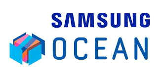

<h1 align="center"> Frontend Web com ReactJS: Integração com Backend </h1>

 

  

  

## 🚀 Tecnologias

Esse projeto foi desenvolvido com as seguintes tecnologias:

  

< align="center">
<h4>Arquivos do curso Jornada frontend, sansung (Ocean Brasil)</h4>

#### É um programa de capacitação tecnológica da Samsung, que o [Ocean](https://oceanbrasil.com) realiza, mensalmente, cursos, eventos e programas gratuitos que fomentam o ecossistema de inovação e tecnologia de forma presencial e online.

- Mais sobre o projeto desenvolvido no curso [aqui.](https://miro.com/app/board/uXjVM158VSo=/?share_link_id=632396607701)

## Deploy do projeto

Confira [aqui em breve.]()
---
<!-- duplicar código:
Alt + Shit + Seta para cima ou para baixo -->

<!-- Alt + Shift + O: Otimizar Imports -->